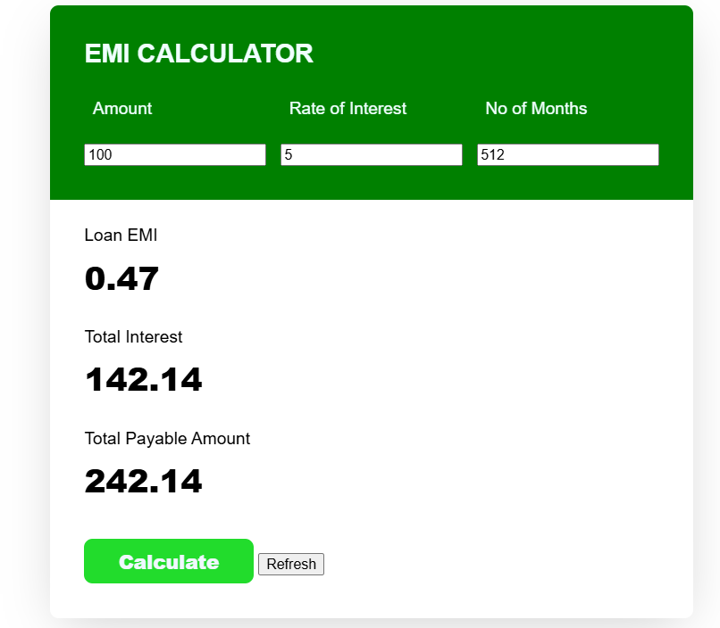

# EMI-Calculator

This is a basic interest calculator for calculating the EMI based on interest rate, amount and tenure of loan.

Developed using html, css and vanila JS. 
A pet project for showcasing my skills and colaborating with my partner. Practicing the proper git guidelines, understanding the git and hands on practices.